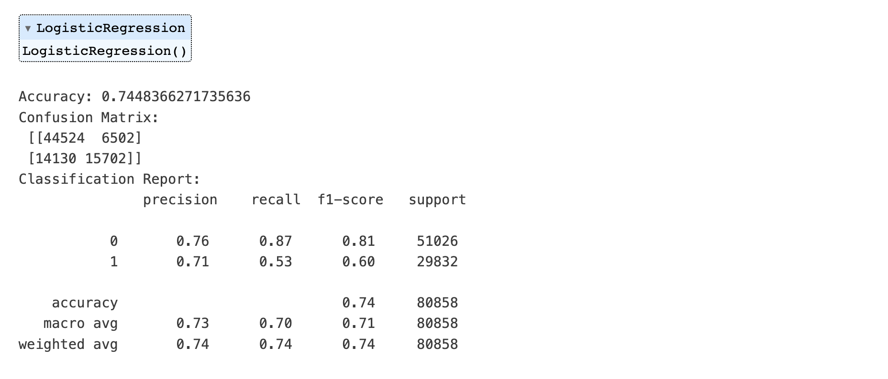

# Quora Question Pairs Project

This project aims to identify duplicate questions in the Quora dataset. The goal is to develop a machine learning model that can accurately predict whether two given questions are duplicates or not.

## Dataset

The dataset used in this project is the [Quora Question Pairs dataset](https://drive.google.com/file/d/19iWVGLBi7edqybybam56bt2Zy7vpf1Xc/view?usp=sharing), which contains over 400,000 pairs of questions.

  

## Data Preprocessing

The data preprocessing steps include:
- Cleaning the text (removing special characters, lowercasing, and tokenizing)
- Combining question pairs into a single feature
- Extracting features using the TF-IDF vectorizer

| Step                      | Description                                                                                                                  |
|---------------------------|------------------------------------------------------------------------------------------------------------------------------|
| Text Cleaning             | Remove special characters, punctuation, and stopwords, and convert text to lowercase.                                        |
| Tokenization              | Split sentences into individual words (tokens).                                                                              |
| Remove Stopwords          | Filter out common words that do not carry much meaning.                                                                      |
| Remove Punctuation        | Remove non-alphanumeric characters from tokens.                                                                              |
| Normalize                 | Convert all tokens to lowercase.                                                                                             |
| Stemming                  | Reduce words to their root form.                                                                                             |
| Combine Questions         | Concatenate cleaned versions of question1 and question2.                                                                     |
| Vectorization             | Convert text data into numerical features using TfidfVectorizer.                                                             |

## Models

Several models were experimented with for this problem:

### Logistic Regression

- LogisticRegression from the sklearn library
- No hyperparameter tuning
- Result:

  

### XGBoost

- XGBClassifier from the xgboost library

Best Hyperparameters:
- learning_rate: 0.2
- max_depth: 20
- n_estimators: 300
- Result:

  

### Random Forest

- RandomForestClassifier from the sklearn library
- Initially attempted hyperparameter tuning using GridSearchCV, but abandoned due to the general principle that more trees in a random forest model lead to better results
  - n_estimators: [100, 200]
  - max_depth: [None, 10, 20]
  - min_samples_split: [2, 5]
  - min_samples_leaf: [1, 3]
  - Bootstrap: [True, False]

Used Hyperparameters:
  - n_estimators: 300
  - max_depth: None
  - min_samples_split: 2
  - min_samples_leaf: 1
  - Bootstrap: False
- Result:

  

### LSTM

- LSTM model implemented using Keras
- Best epoch step: 14
- Result: The iteration was interrupted due to the time limit. The accuracy was 0.80. F1 score, precision, and recall were not saved due to the interruption. They will be updated in the future.

  

## Results

| Model              | F1 Score | Precision | Recall | Accuracy | GPU Compatible |
|--------------------|----------|-----------|--------|----------|----------------|
| Logistic Regression| 0.71     | 0.73      | 0.70   | 0.74     | No             |
| XGBoost            | 0.78     | 0.80      | 0.77   | 0.80     | Yes            |
| Random Forest      | 0.80     | 0.81      | 0.79   | 0.82     | No             |
| LSTM               | (N/A)    | (N/A)     | (N/A)  | 0.80     | Yes            |

During the feature engineering step, the "Combine Questions" process plays a crucial role, as it defines the presence or absence and the order of words in the questions. Some models, such as XGBoost, Random Forest, and LSTM, are capable of recognizing the order of words, which means they can take the order into consideration when making predictions. On the other hand, models like Logistic Regression can only consider the presence or absence of words, limiting their capacity to fully capture the relationships between questions. Thus, the choice of model can greatly influence the ability to accurately identify duplicate questions based on the information extracted during feature engineering.

## Conclusions

Through this project, a deeper understanding of the characteristics of different models and their parameter-tuning methods was gained. Experiments were conducted with Random Forest, LSTM, and XGBoost models and the following observations were made:

1. Random Forest: Instead of spending time selecting the optimal parameter combination through GridSearch, one could rely on experience and specify a relatively safe but computationally intensive parameter combination. This way, good results can be obtained in a relatively short time. Random Forest has many adjustable parameters, so determining the optimal combination through GridSearch can be time-consuming and costly. However, increasing the number of trees in the forest can generally improve the model's performance.

2. LSTM: This method is advantageous for handling prediction problems sensitive to order, such as the relative position of words in sentences. By capturing grammar and the relationships between words, LSTM can achieve relatively good results.

3. XGBoost: This method is effective for handling nonlinear problems. The features, the combination of question one and question two, are nonlinear in nature, so XGBoost can achieve relatively good results.

4. Logistic Regression: Logistic Regression is still useful for this project because it serves as a simple and efficient baseline model for binary classification tasks. Although it does not consider the time order of the words in a sentence, it can capture the presence or absence of certain words and their relationship to the target variable. In this case, the presence of specific words or phrases in both questions can be indicative of their similarity. By comparing the performance of Logistic Regression with more complex models like LSTM, the benefits and limitations of each approach can be better understood.

The main challenge with the LSTM method is determining a reasonable batch size. A larger batch size can improve computational speed, but if it exceeds the GPU's memory or is too small, it may not fully utilize the GPU's computing power. Additionally, an excessively large batch size might affect the model's convergence or lead to overfitting problems.

In the LSTM loss vs epoch plot, the values represent the loss function's output, not the accuracy. The loss function measures the difference between the model's predictions and the actual target values. Lower loss values indicate that the model is performing better, and higher loss values indicate that the model is performing worse. For example, if the model uses the binary cross-entropy loss function, the loss value represents the average negative log-likelihood of the true class labels given the model's predicted probabilities.

---

The loss vs. epoch plot in the LSTM model shows the training and validation loss values at each epoch. Here's a brief explanation of the terms:

The loss vs. epoch plot in the LSTM model shows the training and validation loss values at each epoch. Here's a brief explanation of the terms:

- **Loss**: The training loss is the value of the objective function (or cost function) that the model tries to minimize during training. In this case, it's the error between the model's predictions and the actual target values. A lower training loss indicates that the model is fitting the training data well.
- **Val_loss**: The validation loss is the value of the objective function calculated on a separate set of data not used for training. This is used to evaluate how well the model generalizes to new, unseen data. A lower validation loss indicates that the model is generalizing well.

To evaluate the algorithm, both the training loss and validation loss should be considered. Here's how to interpret the plot:

1. If both training and validation loss decreases over time and converge to similar values, it indicates that the model is learning and generalizing well.

2. If the training loss is decreasing, but the validation loss is increasing or remains constant, it indicates that the model is overfitting. This means that the model is fitting the training data too closely and fails to generalize to new data.

3. If the training loss and validation loss are not decreasing or converging, it could indicate that the model is underfitting, meaning it's not learning the underlying patterns in the data. In this case, a more complex model or better features might be needed.

To further evaluate the algorithm, other performance metrics such as accuracy, precision, recall, and F1-score can also be considered, depending on the specific problem and requirements. Additionally, techniques like cross-validation can be used to get a more robust estimate of the model's performance.

| Modification                          | Purpose of Modification                                                                                                  |
|---------------------------------------|--------------------------------------------------------------------------------------------------------------------------|
| Added L2 regularization               | Penalizes large weights in the model to reduce overfitting by adding a penalty term to the loss function.                |
| Added Dropout layer                   | Randomly sets a fraction of input units to 0 during training, helping prevent overfitting.                                |
| Added BatchNormalization layer        | Improves model training and reduces overfitting by normalizing the input layer by re-centering and re-scaling.           |
| Lowered the learning rate             | Reduces the step size taken by the optimizer during training, allowing for more precise convergence and preventing overshooting the optimal weights. |
| Implemented Early Stopping            | Stops the training process when the validation loss starts to increase, even if the training loss continues to decrease. |

## Future Work

Future work for this project could include:

1. Examine the validity of the original dataset's label accuracy: There have been some errors found in the dataset. Utilize the `fuzzywuzzy` library to find false negatives in the data.
2. Try using the Universal Sentence Encoder (USE) to create sentence embeddings for the questions and then comparing the embeddings using cosine similarity. This approach could help capture more complex relationships between the questions.
3. Experiment with the BERT model from Hugging Face Transformers for this task. BERT has shown state-of-the-art performance on a variety of natural language processing tasks and could potentially improve the performance of the model for identifying duplicate questions. 

By exploring these additional approaches, the project can be further enhanced, potentially leading to more accurate predictions and a better understanding of the relationships between questions in the dataset.

## Dependencies

- Python 3.10
- pandas
- numpy
- scikit-learn
- Keras
- xgboost
